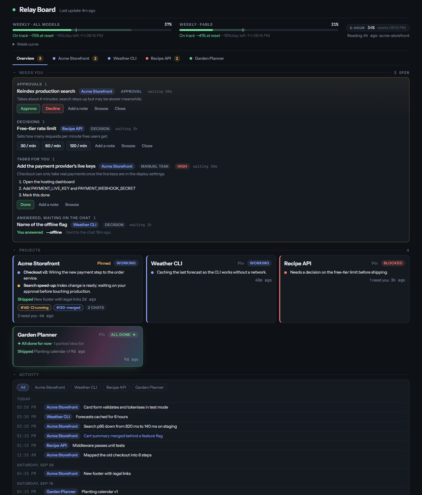
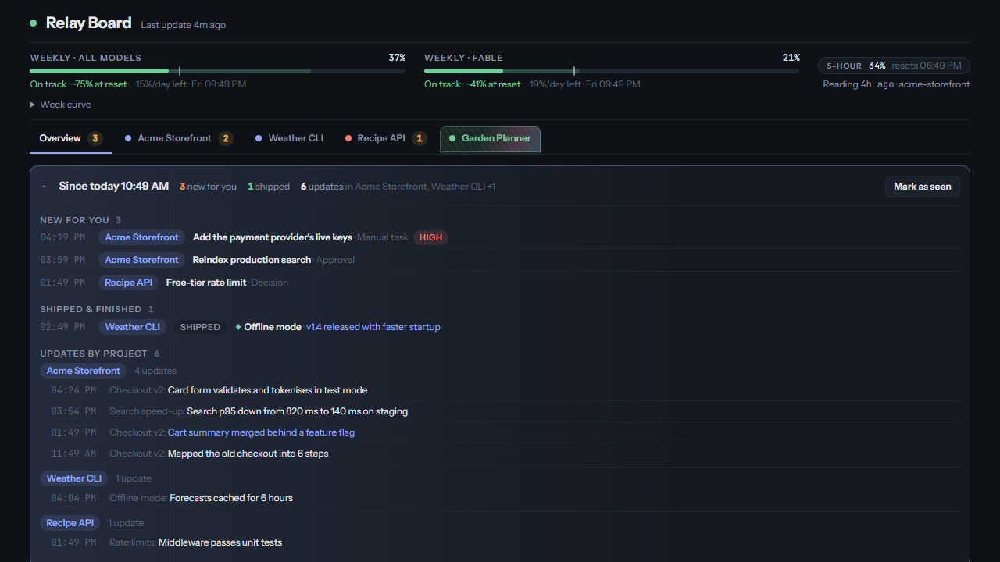
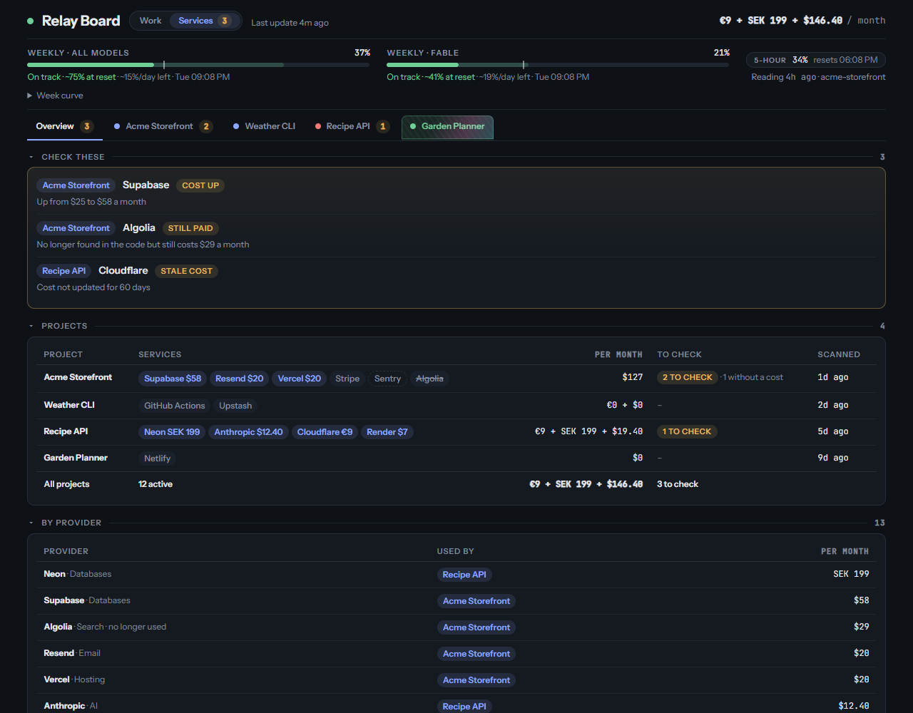
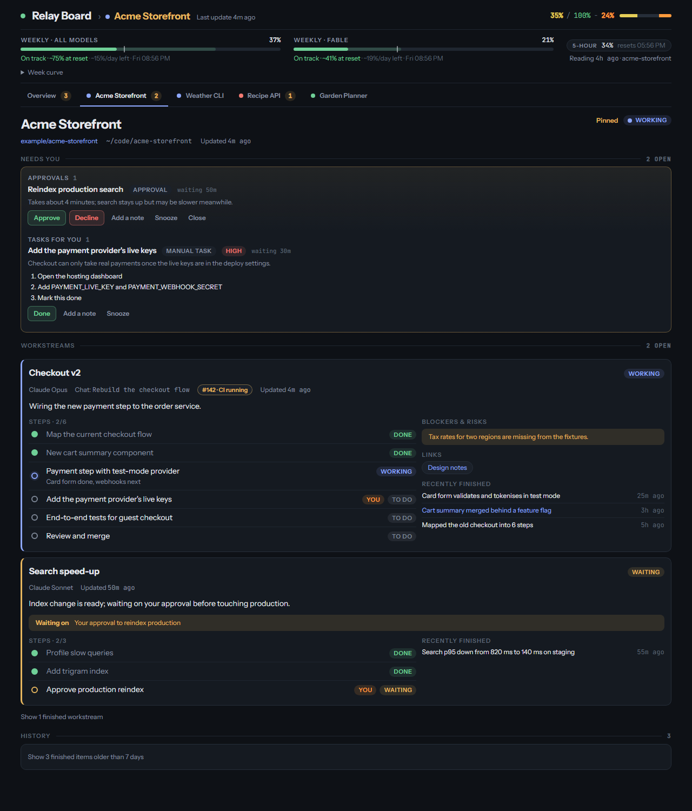

# Relay Board

[](https://github.com/Tquillity/relay-board/actions/workflows/ci.yml)

**One page to follow every Claude Code chat you have running, across all your projects.**

When several AI coding agents work in parallel, it's hard to keep track of which one is making progress, which one has quietly stopped, and which one is waiting for *you*: an approval, a decision, a key only you can add. Relay Board answers that at a glance. Agents post short status updates as they work, and the board turns them into project tabs, a single "Needs you" list, progress bars and a "since you last looked" summary.

It is a single-file [claude.ai artifact](https://support.anthropic.com/en/articles/9487310-what-are-artifacts-and-how-do-i-use-them): about 1,500 lines of vanilla JavaScript and CSS, with no dependencies and no build step. The data lives in the artifact's built-in database.

**[Try the live demo →](https://tquillity.github.io/relay-board/demo/)** (made-up projects and data)



## Features

- **A tab per project, a card per chat.** Status, current task, steps, blockers, PR and CI state, and recent activity for every agent chat ("workstream").
- **Needs you.** One list, across all projects, of the tasks, approvals and decisions only you can handle. Answer them on the board, and the answer is relayed back to the chat that asked.
- **Progress at a glance.** The header shows how far the open project's live work has come, for example `35% / 100% − 24%`. The last number is the share waiting on you, and progress can't pass 100 minus it until you've done your part. Finished projects stay at a green `100%` and get a holographic "foil card" shimmer.
- **Since you last looked.** A one-line summary ("3 new for you · 1 shipped · 6 updates in Acme, Weather CLI") that opens into the actual items, each linked to its project.
- **Quiet-chat detection.** A chat that says it's working but hasn't reported in a while is flagged as quiet, then as possibly stopped.
- **Plan usage.** Weekly and 5-hour usage bars for the Claude plan, with an even-pace marker and a projection to the weekly reset.
- **History that never fills up.** Done items fold away, move to a per-project History after 7 days, and after 30 days are condensed into one archive record per project and month.
- **Services and their cost.** A second view, switched with Work | Services in the header, shows for each project which third-party services it uses (payments, database, hosting, email and so on) and what they cost per month, with totals per currency (never converted). It warns about a removed service that still costs money, a bill that jumped, and a cost nobody has confirmed for 45 days. You can type in a cost for any service; a scanner run fills in the rest.
- **Foldable sections** that remember what you folded, a cross-project activity feed, and a layout that works on a phone.







## How it works

```
Claude Code chats ──(short status writes, one per milestone)──▶ artifact database ◀──(live updates)── the board in your browser
        ▲                                                                │
        └──────────────── "an answer is waiting for you" ◀───────────────┘  (any agent relays your answers)
```

- **Agents write facts; the page does the thinking.** Agents write four small collections: `projects`, `streams`, `needs` and `usage`. Progress, projections, quiet detection, the digest and archiving are all computed in the browser. Keeping the board current therefore costs agents very few tokens.
- **Answers flow back.** When you answer a "Needs you" item, the next agent that writes to the board claims the answer with a versioned write, so two agents can't both take it. It then messages the chat that asked.
- **Safe by construction.** The page builds all its DOM with `textContent`, never `innerHTML`. It only links `http(s)` URLs, and it never deletes a record before its summary is safely archived.
- **Pure core, thin UI.** The page has two scripts: a core of pure functions (progress, quiet detection, the digest, usage projections, what to archive) that takes the data and the current time as arguments, and a UI that renders it and talks to the database.

The full data model and the rules agents follow are in [`PROTOCOL.md`](PROTOCOL.md).

## Run the demo locally

Requires Node.js 18 or later. There is nothing to install.

```bash
npm run demo    # builds docs/demo/index.html
```

Open `docs/demo/index.html` in a browser. It is the real `index.html` with an in-memory stand-in for the artifact database ([`demo/mock-db.js`](demo/mock-db.js)), filled with made-up projects. Buttons work, but nothing is saved.

```bash
npm run check   # the page and demo parse, the demo is up to date, and nothing private is committed
```

## Tests

```bash
npm test            # everything
npm run test:unit   # unit tests only, well under a second
npm run test:e2e    # the demo and scripted scenarios in headless Chrome
```

The tests use Node's built-in test runner, so there is still nothing to install.

- **Unit tests** load the page's core script straight from `index.html` into a sandbox with no DOM, and check it against the rules in [`PROTOCOL.md`](PROTOCOL.md). They cover progress weights and rounding (including a randomised check that done plus waiting-on-you never passes 100%), when a project counts as finished, quiet thresholds, needs, snoozing and stuck answers, History and archiving, usage projections, and the digest. Malformed data, unsafe links and exact boundaries are covered too, as is text contrast (WCAG AA). Every unit test runs against a fixed clock.
- **End-to-end tests** build the demo, load it in headless Chrome and check what renders: tabs and badges, the progress header, the foil on the finished project, the digest, and History. They also cover the Services overview and a project's services.
- **Behaviour tests** run the real page against a scriptable fake database ([`test/harness.js`](test/harness.js)) and act on it like a viewer: another chat resuming a card while it is being archived, a slow save that then fails, a live connection dropping, data arriving out of order, malformed docs, reopening and resending answers, and keyboard use of the tabs. One scenario enters, changes and clears a service cost against a slow store.

The browser tests are skipped if Chrome isn't found. Set `CHROME=/path/to/chrome` to point at one.

CI runs `npm run check` and `npm test` on every push to `main` and on pull requests.

## Set up your own board

1. In [claude.ai](https://claude.ai), publish `index.html` as an artifact with the `db` capability enabled. Keep it private: it will show your projects.
2. Give your agents the board's URL and the rules in [`PROTOCOL.md`](PROTOCOL.md). A global instruction file works well, for example `~/.claude/CLAUDE.md` for Claude Code, so that every chat in every project follows them.
3. To change the page later, edit `index.html`, run `npm run check` and `npm test`, and republish it to the same artifact. The stored data carries over.

## Known limitations

- The "Open chat" links use the `claude://` scheme, which only opens the chat when the Claude desktop app is installed.
- The usage projection based on last week's rhythm needs a full week of readings, so it only kicks in during the second week.
- Plan usage readings come from the Claude Code desktop app's session tools (see [`PROTOCOL.md`](PROTOCOL.md)). "Fable" is one of Claude's model tiers, which has its own weekly limit.

## Project layout

| Path | What it is |
| --- | --- |
| [`index.html`](index.html) | The board: markup, styles, the pure core script and the UI script in one file |
| [`PROTOCOL.md`](PROTOCOL.md) | Data model and the rules agents follow |
| [`demo/`](demo) | Made-up data, an in-memory database, and the demo build script |
| [`docs/demo/`](docs/demo) | The built demo, served by GitHub Pages |
| [`scripts/check.mjs`](scripts/check.mjs) | Dependency-free checks |
| [`test/`](test) | Unit tests of the core, end-to-end tests of the demo, and behaviour tests with a fake database |
| [`.github/workflows/`](.github/workflows) | CI: checks and tests on pushes to `main` and on pull requests |
| [`docs/screenshots/`](docs/screenshots) | Screenshots taken from the demo, and how to retake them |

## License

[MIT](LICENSE) © Mikael Sundh
