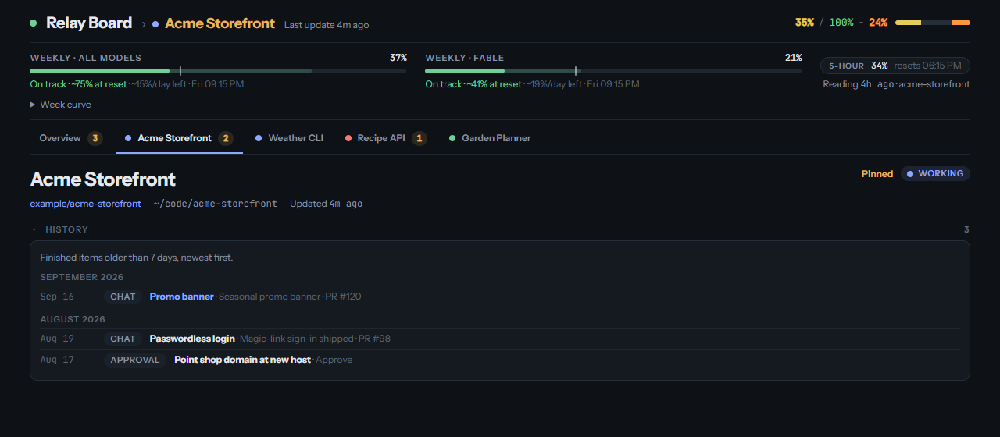

# Relay Board

A live dashboard for following many Claude Code chats across many projects from one page. It runs as a single-file [claude.ai artifact](https://claude.ai) that uses the artifact `db` capability. Agents write short status updates, and the page does all the analysis in the browser, so keeping it current costs agents very few tokens.

> The screenshots below use a demo with made-up projects and data. The real board is a private artifact.


## What it shows

- **One tab per project**, with one card per chat ("workstream"): status, current task, steps, blockers, PR and CI state, recent activity.
- **Needs you:** one list, across all projects, of what only you can do: tasks, approvals and decisions. Answer them on the board and the answer is relayed back to the chat that asked.
- **Progress in the header** for the open project, for example `35% / 100% − 24%`. The first number is the share of live work that's done (red → yellow → green). The last number (orange when above zero) is the share waiting on you, and the first number can't pass 100 minus it until you've done your part. A project with nothing left to do stays at a green `100% / 100% − 0%`, and its card gets a holographic foil shimmer. Parked idea lists don't count as unfinished.
- **Plan usage:** weekly (all models and Fable) and 5-hour bars, with an even-pace marker and a projection to the weekly reset.
- **Quiet-chat detection:** a chat that says it's working but hasn't written for a while is flagged, and so is one waiting too long on something other than you.
- **"Since you last looked"** digest and an activity feed.
- **Foldable sections:** click any section header (Needs you, Projects, Activity, Workstreams, History) to fold it. The board remembers your choice in this browser.
- **History:** done items fold away at once, move to a per-project History section after 7 days, and after 30 days are squeezed into one archive record per project and month. You can look back as far as you like, and the store never fills up.




## How it works

```
Claude Code chats ──(ArtifactData writes, one per milestone)──▶ artifact db ◀──(live snapshots)── index.html in your browser
        ▲                                                            │
        └──────────── send_message: "answer waiting on needs/<id>" ◀─┘  (any agent relays your answers)
```

- Agents write four collections: `projects`, `streams`, `needs` and `usage`. The page writes the fifth, `archive`, plus your answers.
- Everything analytical happens in the page: progress, projections, quiet detection, the digest and archiving.
- The full data model and the rules agents follow are in [`PROTOCOL.md`](PROTOCOL.md).

## Try the demo

```bash
node demo/build.mjs
```

Then open `demo/board-demo.html` in a browser. It is the real `index.html` with an in-memory stand-in for the `db` capability ([`demo/mock-db.js`](demo/mock-db.js)), filled with made-up projects. Buttons work, but nothing is saved.

To take the screenshots again, point `CHROME` at your Chrome binary (`google-chrome` on Linux, `"/Applications/Google Chrome.app/Contents/MacOS/Google Chrome"` on macOS, `"/c/Program Files/Google/Chrome/Application/chrome.exe"` in Git Bash on Windows), then:

```bash
DEMO="file://$(pwd -W 2>/dev/null || pwd)/demo/board-demo.html"
shot() { "$CHROME" --headless=new --hide-scrollbars --lang=en-US --window-size="$2" --virtual-time-budget=4000 --user-data-dir="$(mktemp -d)" --screenshot="$PWD/docs/screenshots/$1.png" "$DEMO$3"; }
shot overview 1280,1500 ""
shot project  1280,1500 "#p=acme-storefront"
shot history  1280,560  "?open=history&only=history#p=acme-storefront"
```

A fresh `--user-data-dir` each time lets this run while your normal Chrome is open, and starts with every section in its default open or folded state.

## Publish a change to your own board

Use the `Artifact` tool with `action: publish`, `url` set to your board's URL, and `file_path` set to `index.html`.

- Leave out `capabilities`. The `db` capability then carries over from the current version.
- Leave out `icon` and `contract`, so the board keeps its icon and runtime version (currently `0.2.60`).
- Always pass `url`. Publishing without it creates a separate board.

Commit every published change, so `main` always matches what is live.

## Verify a change

1. Check that the page script parses (Git Bash or any POSIX shell):

   ```bash
   tr -d '\r' < index.html | sed -n '/^<script>$/,/^<\/script>$/p' | sed '1d;$d' > "${TMP:-/tmp}/board.js" && node --check "${TMP:-/tmp}/board.js"
   ```

   This expects the page's single `<script>` and `</script>` tags each alone on a line at column 0.

2. Open the demo to check the change visually.
3. After publishing, run one `ArtifactData` `list` for each collection the change touches, and check the documents still have the shape the page expects.

## Privacy and secrets

This repo is public; the board is not.
- Never commit secrets (tokens, keys, passwords, connection strings), the real board's URL, or anything copied from its database.
- Screenshots and examples come only from the demo's made-up data.

## Not yet verified

- The answer relay (answered → relayed → handled via `send_message`) hasn't been exercised end to end.
- The `claude://` "Open chat" links may not open from inside the artifact.
- The last-week-rhythm usage projection needs a full week of readings before it kicks in.

## Files

| File | Purpose |
| --- | --- |
| `index.html` | The page, identical to the published version |
| `PROTOCOL.md` | Data model and the rules agents follow when writing to the board |
| `demo/mock-db.js` | Made-up data and an in-memory `db` for the demo |
| `demo/build.mjs` | Builds `demo/board-demo.html` (not committed) |
| `docs/screenshots/` | Screenshots taken from the demo |
